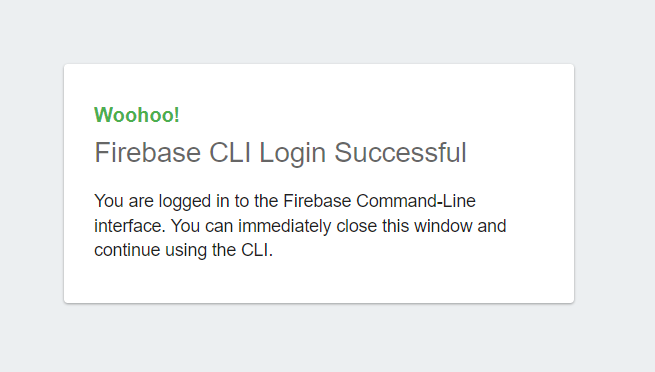
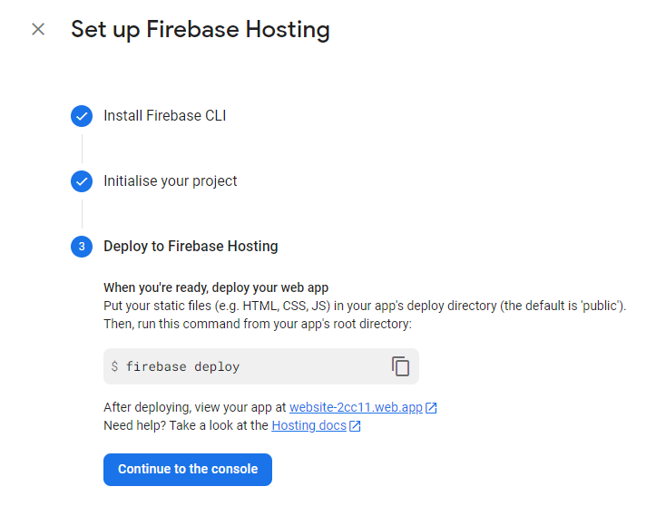
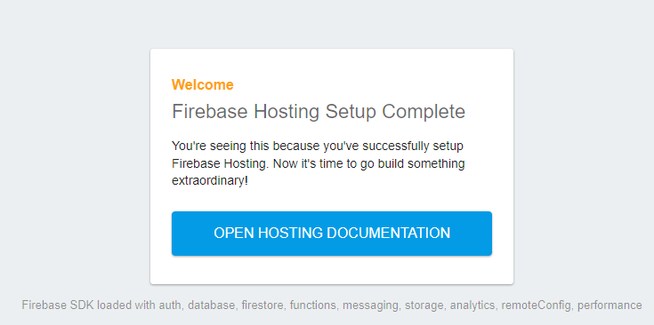

# default firebase hosting project 

 - create a new project in firebase hosting;
 - create a new local project;
 - create a new folder named 'public';

```npm init ```

```npm install -g firebase-tools```

```
firebase login

i  Firebase optionally collects CLI and Emulator Suite usage and error reporting information to help improve our products. Data is collected in accordance with Google's privacy policy (https://policies.google.com/privacy) and is not used to identify you.

? Allow Firebase to collect CLI and Emulator Suite usage and error reporting information? Yes
i  To change your data collection preference at any time, run `firebase logout` and log in again.

Visit this URL on this device to log in:
...

Waiting for authentication...

+  Success! Logged in as ...

```



 - next steps can be found on firebase website settings to deploy local project : 



``` firebase init 

     ######## #### ########  ######## ########     ###     ######  ########
     ##        ##  ##     ## ##       ##     ##  ##   ##  ##       ##
     ######    ##  ########  ######   ########  #########  ######  ######
     ##        ##  ##    ##  ##       ##     ## ##     ##       ## ##
     ##       #### ##     ## ######## ########  ##     ##  ######  ########

You're about to initialize a Firebase project in this directory:

  F:\HostingFirebase

? Are you ready to proceed? Yes
? Which Firebase features do you want to set up for this directory? Press Space to select features, then Enter to confirm your choices. (Press <space> to select, <a> to toggle all, <i> to 
invert selection, and <enter> to proceed)
 ( ) Realtime Database: Configure a security rules file for Realtime Database and (optionally) provision default instance
 ( ) Firestore: Configure security rules and indexes files for Firestore
 ( ) Functions: Configure a Cloud Functions directory and its files
>(*) Hosting: Configure files for Firebase Hosting and (optionally) set up GitHub Action deploys
 ( ) Hosting: Set up GitHub Action deploys
 ( ) Storage: Configure a security rules file for Cloud Storage
 ( ) Emulators: Set up local emulators for Firebase products
(Move up and down to reveal more choices)

```
 - use spacebar key to select Hosting 
```
=== Project Setup

First, let's associate this project directory with a Firebase project.
You can create multiple project aliases by running firebase use --add,
but for now we'll just set up a default project.

? Please select an option: (Use arrow keys)
> Use an existing project
  Create a new project
  Add Firebase to an existing Google Cloud Platform project
  Don't set up a default project
```
 - select my project name 

```  javascriptfirebase001 (JavaScriptFirebase001)
  my-test-project-feae6 (My Test Project)
  reactfirebasetest001 (ReactFirebaseTest001)
  vue-firebase-17d5f (vue-firebase)
> website-2cc11 (website)
  xamarinapp-8cccb (XamarinApp)

```
 - select the folder named 'public' where is the running application:

```
? What do you want to use as your public directory? public
? Configure as a single-page app (rewrite all urls to /index.html)? No
? Set up automatic builds and deploys with GitHub? No
+  Wrote public/404.html
+  Wrote public/index.html

i  Writing configuration info to firebase.json...
i  Writing project information to .firebaserc...
i  Writing gitignore file to .gitignore...

+  Firebase initialization complete!
```
 - use this command to deploy your project;

```
firebase deploy

=== Deploying to 'website-2cc11'...

i  deploying hosting
i  hosting[website-2cc11]: beginning deploy...
i  hosting[website-2cc11]: found 2 files in public
+  hosting[website-2cc11]: file upload complete
i  hosting[website-2cc11]: finalizing version...
+  hosting[website-2cc11]: version finalized
i  hosting[website-2cc11]: releasing new version...
+  hosting[website-2cc11]: release complete

+  Deploy complete!

Project Console: https://console.firebase.google.com/project/website-2cc11/overview
Hosting URL: https://website-2cc11.web.app
```
 - first deploy project result :

 

